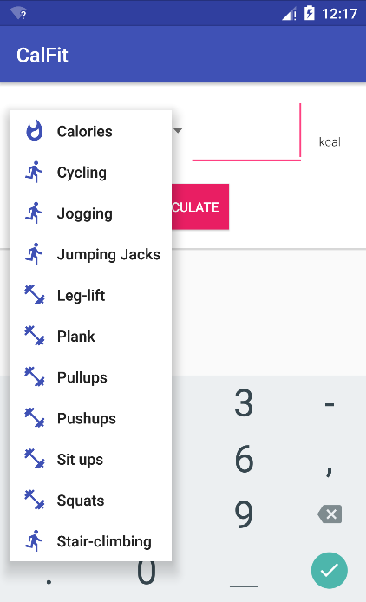
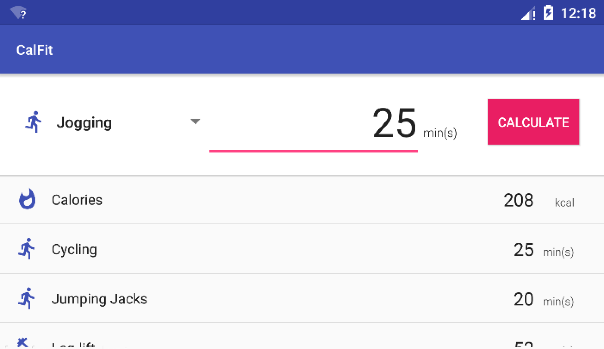

# PROG 01: Crunch Time

CalFit is a calories workout conversion app that computes basic conversions between 13 options, calories and 12 types of workout exercises. To calculate a conversion, simply choose the activity you want to convert from the spinner, enter the amount of calories, minutes, or reps you would like to convert, then click the calculate button. A list will be generated with the conversion values for the 12 other items (not including the one you chose). To make a new conversion, just click on the input text field to enter a new amount or choose a different activity from the spinner. Then, click calculate again to update the list and see the new conversion values.

## Authors

Annie Lo ([annielo@berkeley.edu](mailto:annielo@berkeley.edu))

## Demo Video

See [PROG 01: Crunch Time] (https://youtu.be/-lNnLnImYfE)

## Screenshots

## Acknowledgements

Icons: [Google Material Icons] (https://design.google.com/icons/)

*Feel free to enhance your README. For Markdown syntax, see [the GitHub Guides](https://guides.github.com/features/mastering-markdown/). Remove this line in your submission.*
